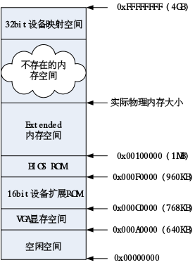
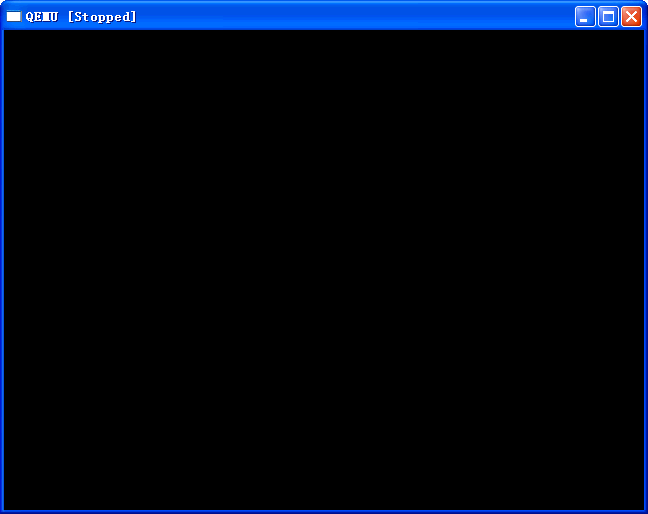
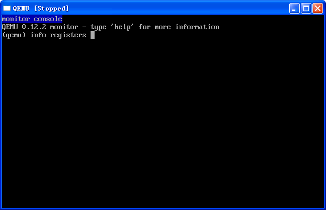
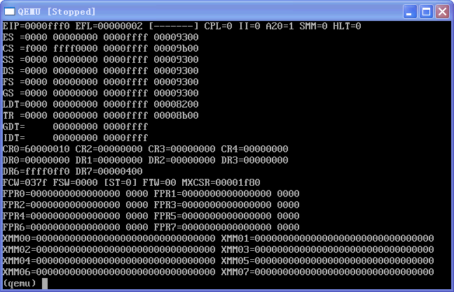

# 【背景】Intel 80386加电后启动过程

## 【要点（非OSP）：80836物理内存地址空间】

## 【要点（非OSP）：80836加电后的第一条指令位】

大家一般都知道bootloader负责启动操作系统，但bootloader自身是被谁加载并启动的呢？为了追根溯源，我们需要了解当计算机加电启动后，到底发生了什么事情。

对于绝大多数计算机系统而言，操作系统和应用软件是存放在磁盘（硬盘/软盘）、光盘、EPROM、ROM、Flash等可在掉电后继续保存数据的存储介质上。当计算机加电后，一般不直接执行操作系统，而是一开始会到一个特定的地址开始执行指令，这个特定的地址存放了系统初始化软件，通过执行系统初始化软件（可固化在ROM或Flash中，也称firmware，固件）完成基本I/O初始化和引导加载操作系统的功能。简单地说，系统初始化软件就是在操作系统内核运行之前运行的一段小软件。通过这段小软件的基本I/O初始化部分，我们可以初始化硬件设备、建立系统的内存空间映射图，从而将系统的软硬件环境带到一个合适的状态，以便为最终调用操作系统内核准备好正确的环境。最终系统初始化软件的引导加载部分把操作系统内核映像加载到RAM中，并将系统控制权传递给它。 

对于基于Intel 80386的计算机而言，其中的系统初始化软件由BIOS (Basic Input Output System，即基本输入/输出系统，其本质是一个固化在主板Flash/CMOS上的软件)和位于软盘/硬盘引导扇区中的OS Boot Loader（在ucore中的bootasm.S和bootmain.c）一起组成。BIOS实际上是被固化在计算机ROM（只读存储器）芯片上的一个特殊的软件，为上层软件提供最底层的、最直接的硬件控制与支持。

以基于Intel 80386的计算机为例，计算机加电后，整个物理地址空间如下图所示：

图2-1 基于Intel 80386的计算机物理地址空间

处理器处于实模式状态（在86386中，段机制一直存在，可进一步参考2.1.5 【背景】理解保护模式和分段机制），从物理地址0xFFFFFFF0开始执行。初始化状态的CS和EIP确定了处理器的初始执行地址，此时CS中可见部分-选择子（selector）的值为0xF000，而其不可见部分-基地址（base）的值为0xFFFF0000；EIP的值是0xFFF0，这样实际的线性地址（由于没有启动也机制，所以线性地址就是物理地址）为CS.base+EIP=0xFFFFFFF0。在0xFFFFFFF0这里只是存放了一条跳转指令，通过跳转指令跳到BIOS例行程序起始点。更详细的解释可以参考文献[1]的第九章的9.1节“INITIALIZATION OVERVIEW”。另外，我们可以通过硬件模拟器qemu来进一步认识上述结果。

### 实验2-1：通过qemu了解Intel 80386启动后的CS和EIP值，并分析第一条指令的内容

1. 启动qemu并让其停到执行第一条指令前，这需要增加一个参数”-S” 
	qemu –S
2. 这是qemu会弹出一个没有任何显示内容的图形窗口，显示如下：

3. 然后通过按”Ctrl+Alt+2”进入qemu的monitor界面，为了了解80386此时的寄存器内容，在monitor界面下输入命令 “info registers”

4. 可获得intel 80386启动后执行第一条指令前的寄存器内容，如下图所示

从上图中，我们可以看到EIP=0xfff0，CS的selector=0xf000，CS的base=0xfff0000。

		BIOS做完计算机硬件自检和初始化后，会选择一个启动设备（例如软盘、硬盘、光盘等），并且读取该设备的第一扇区(即主引导扇区或启动扇区)到内存一个特定的地址0x7c00处，然后CPU控制权会转移到那个地址继续执行。至此BIOS的初始化工作做完了，进一步的工作交给了ucore的bootloader；ucore的bootloader会完成处理器从实模式到保护模式的转换，并从硬盘上读取并加载ucore。其大致流程如下图所示：

图2-2 Intel80386启动过程
