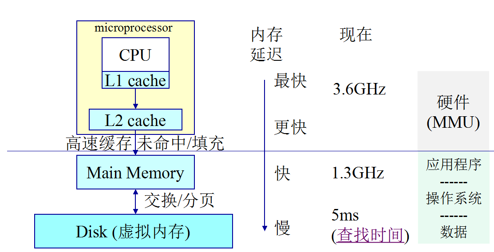

# PC计算机
这里简单介绍一下运行ucore的个人计算机(PC)硬件平台。PC可抽象为CPU、内存和 I/O 设备。CPU(中央处理器，也称处理器) 负责计算和读写内存，内存用于保存指令和数据，外部设备用于实现显，网络，声音，传输等其他其他功能。
操作系统直接运行在PC硬件平台上。

## CPU

CPUs是计算机系统的核心，从一加电开始，按照取指令，执行指令的循环周而复始地运行。取指令的过程即从某寄存器（比如，程序计数器）中获取一个内存地址，从这个内存地址中读入指令，执行机器指令，不断重复，CPU运行期间会有分支和调用指令来修改程序计数器，否则程序计数器就自动加１，让CPU从下一个内存地址单元取指令，并继续执行。

## 内存层次

计算机中有多种存放数据和指令代码的单元，比如在CPU内的寄存器（register）、缓存(cache)、内存（memory）、硬盘、磁带等。寄存器访问速度最快但成本昂贵，在80386处理器中只有十个左右的通用寄存器；ache  一般也在CPU内部,cache是内存和寄存器在速度和大小上的折衷，比寄存器慢2~10倍，容量也有限，量级大约几百KB到几十MB不等；再接下来就是内存了，内存位于CPU外，比寄存器慢10倍以上，但容量大，目前一般以GB到几百GB不等；硬盘一般比寄存器要慢1000倍以上，但掉电后其存储的数据不会丢失。由于寄存器、cache、内存、硬盘在读写速度和容量上的巨大差异，所以需要操作系统来协调数据的访问，尽量主动或协助应用软件，把经常访问的数据放到寄存器或cache中，把不长用的数据放到硬盘上，这样可以达到让多个运行的应用程序“感觉”到它可用使用很大的空间，也可用有很快的访问速度。切jx86，都在芯片上的缓存中保存了最近使用的主存数据

## I/O

处理器处理的数据需要从外设（比如键盘）中获得，且在处理完毕后要传给外设（比如显示器）进一步处理。。80386 CPU 有两条特殊的 `in`和`out` 指令来在完成与设备的访问交互。其他的CPU也可以通过外设映射的*内存*来用通常的内存读写指令来管理设备。

